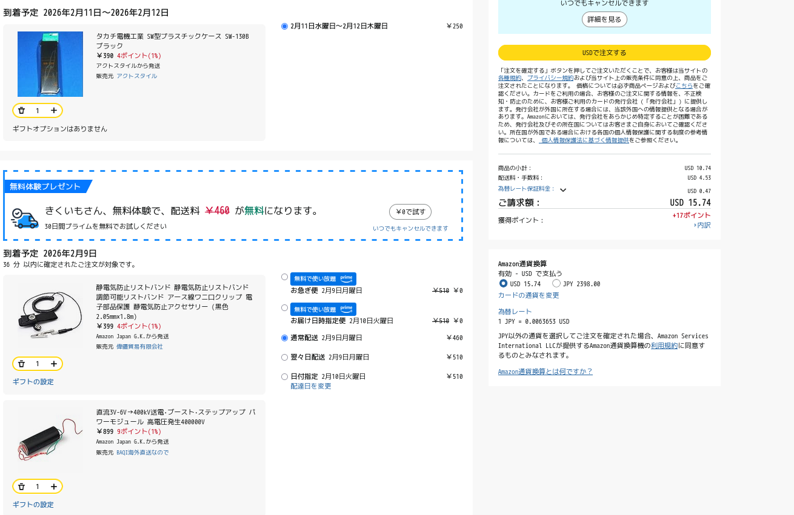
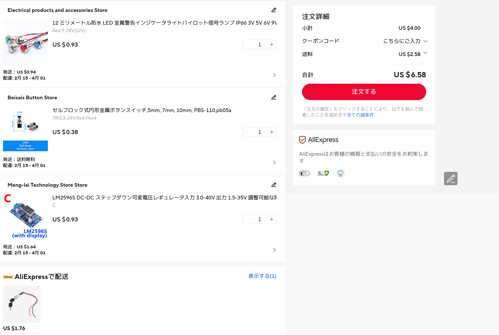

# Electricity-hacker
イオンレイガンを作ってみたくなったので、市販されている高電圧発生モジュールで比較的簡単に作れないか模索するためのプロジェクトです  
参考文献: 塩見正孝 et al., 『電子工作超ガイド』, 三才ブックス, 2017年8月25日

# Project description
This is commonly referred to as an ion ray gun.  
Using this device allows you to project ions, enabling actions such as turning on fluorescent lights at a distance, causing electronic devices to malfunction, or destroying them.  

# Screenshots
## Schematics

## Estimates
Amazon  
  
Aliexpress  
  

## BOM
|Item                   |Quantity|
|-----------------------|--------|
|Copper Plate           |1       |
|Register 1MOhm         |1       |
|006P Battery Snap      |1       |
|Wire                   |1       |
|Pilot lamp             |1       |
|Push Switch(Momentary) |1       |
|DC-DC Converter        |1       |
|High voltage generator |1       |
|Heat shrink tube       |Many    |
|Key lock switch        |1       |
|Anti-static wristband  |1       |
|Plastic case           |2       |
