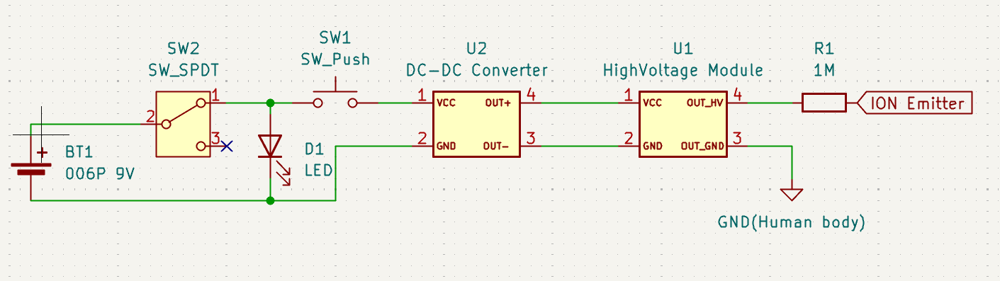

# Electricity-hacker
イオンレイガンを作ってみたくなったので、市販されている高電圧発生モジュールで比較的簡単に作れないか模索するためのプロジェクトです  

# Project description
This is commonly referred to as an ion ray gun.  
Using this device allows you to project ions, enabling actions such as turning on fluorescent lights at a distance, causing electronic devices to malfunction, or destroying them.  

# Screenshots
## Schematics

